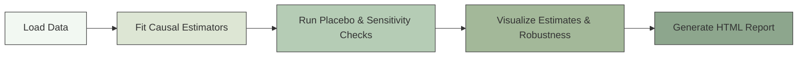

<!-- README.md is generated from README.Rmd. Please edit that file -->

# causalSenseCheck

<!-- badges: start -->

<!-- badges: end -->

[](https://github.com/yryrena/causalSenseCheck/actions)
[](https://app.codecov.io/gh/yryrena/causalSenseCheck)




## Overview

**causalSenseCheck** provides quick diagnostics and robustness checks
for causal inference results.

Causal analysis often requires more than one estimator and careful
checks against placebo tests or sensitivity analyses. This package
streamlines that process by providing a single workflow for:

- Fitting multiple causal estimators consistently.
- Running placebo tests and robustness checks.
- Creating visualizations and reports that make results easy to
  interpret.

The goal is to help researchers stress test causal claims before
publication.

## Features

### Estimators

- **OLS** (linear regression, with optional covariates).
- **Doubly Robust / AIPW** (combines outcome regression + propensity
  scores).
- **Difference-in-Differences (DID)**: two-way fixed effects via fixest.
- **Instrumental Variables (IV)**: 2SLS via AER.
- **Causal Forest** (from **grf**) for heterogeneous effects / CATEs.

### Diagnostics

- **Placebo tests**
  - `random_assign`: shuffle treatment labels.
  - `lead_treatment`: use lagged treatment as a fake lead.
  - `event_lead`: add future treatment as a placebo regressor in TWFE
    models.
- **Sensitivity analyses**
  - Simple tipping-point checks.
  - \[Optional\] Integration with sensemakr for Oster-style robustness.

### Visualization

- `autoplot()` methods for:
  - Comparing estimates across estimators.
  - Displaying placebo distributions.
  - Visualizing sensitivity bands.

### Reporting

- `csc_report()`: generate a one-shot HTML report summarizing:
  - estimation results
  - placebo and sensitivity checks
  - plots and session info

## Installation

You can install the development version from GitHub with:

``` r
# install.packages("remotes")
remotes::install_github("yryrena/causalSenseCheck") 
```

## Quick Example

This workflow demonstrates fitting models, running diagnostics, and
plotting comparisons.

``` r
library(causalSenseCheck)
library(ggplot2)

# load included demo dataset
data(sim_data, package = "causalSenseCheck")

# fit models using OLS, DR, DID
fit <- csc_fit(
  sim_data,
  y = "y",
  d = "d",
  x = c("x1", "x2"),
  estimators = c("ols", "dr", "did"),
  did = list(id = "id", time = "time")
)

# run diagnostics
diag <- csc_diagnose(
  fit,
  placebo = c("random_assign", "lead_treatment")
)

# compare estimates across estimators
autoplot(diag, "compare")
```

### Placebo & Sensitivity Checks

``` r
# placebo distribution
autoplot(diag, "placebo")

# add sensemakr sensitivity 
diag2 <- csc_diagnose(fit, sensitivity = "sensemakr")
```

### Reporting

Generate a self-contained HTML summary:

``` r
csc_report(fit, diag, output_file = "my_causal_report.html", open = TRUE)
```

## When to Use

Use **causalSenseCheck** when you need to:

- Run multiple causal estimators quickly and consistently.
- Provide robustness checks (placebos, sensitivity analysis) to
  reviewers.
- Communicate results with reproducible plots and reports.
